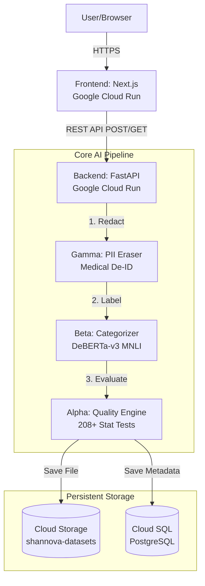
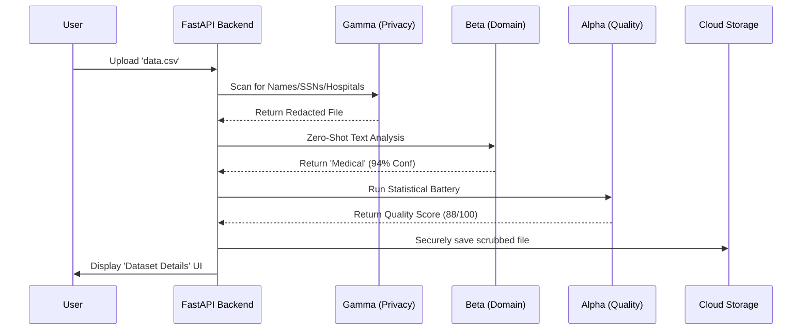

# Shannova Data Platform
## Comprehensive Architecture & System Documentation

---

## 1. System Overview

Shannova is a modern, multimodal data marketplace built on a completely serverless infrastructure using Google Cloud Platform (GCP).

**Core Components:**
- **Frontend:** Next.js 15 (React) application. Provides user interfaces for anonymous dataset uploads, a marketplace browser, and interactive data quality scorecards.
- **Backend:** Python FastAPI. Handles file processing, interacts with AI models, manages database transactions, and generates secure Signed URLs for storage.
- **Storage:** Google Cloud Storage (GCS) for raw datasets and Cloud SQL (PostgreSQL) for metadata and relational data.

---

## 2. Infrastructure Map

---

## 3. The Data Pipeline Lifecycle

When a dataset is uploaded, it is intercepted in memory and processed through three distinct AI algorithms before it is allowed to touch persistent storage.

---

## 4. The Three AI Engines

### 1. Alpha (Data Quality Assessor)
**Purpose:** Calculates a mathematical "health" score (0-100) for the dataset.
**How it works:** Executes a highly robust, 208-test battery using `pandas`, `numpy`, and `scipy`. It limits processing to 200,000 rows to ensure server stability. It evaluates data across 7 dimensions: Completeness, Validity, Consistency, Uniqueness, Representativeness, Balance, and Timeliness.

### 2. Beta (Domain Categorizer)
**Purpose:** Autonomously labels the industry/topic of the dataset.
**How it works:** Uses `MoritzLaurer/DeBERTa-v3-base-mnli-fever-docnli-ling-2c`, a state-of-the-art Hugging Face zero-shot classification model. It reads the raw contents and intelligently maps it to one of Shannova's 12 foundational categories (e.g., Financial, Health/Medical).

---

## 5. The Three AI Engines (Continued)

### 3. Gamma (PII Eraser & Privacy Guard)
**Purpose:** Strips all Personally Identifiable Information (PII) to ensure GDPR compliance and user privacy.
**How it works:** Employs a hybrid deterministic/probabilistic approach:
- **Deterministic:** Uses strict Regex to instantly mask Emails, Phones, SSNs, and Credit Cards.
- **Probabilistic:** Uses `obi/deid_roberta_i2b2`, a specialized healthcare Name Entity Recognition (NER) model, to read the context of the data and hunt down Patient Names, Doctor Names, Hospitals, and Dates, replacing them with safe tags like `[PER_REDACTED]`.

---

## 6. Hosting & Costs

The entire stack is optimized for low-cost, serverless scaling:

*   **Compute (Cloud Run):** Both the Next.js frontend and the FastAPI backend run in isolated Docker containers. They automatically scale down to zero when there is no traffic, effectively making them free during idle periods.
*   **Database (Cloud SQL):** Runs 24/7 on an `f1-micro` instance to keep relational data instantly available.
*   **Object Storage (Cloud Storage):** Highly durable storage for physical files, costing only pennies per month depending on upload volume.